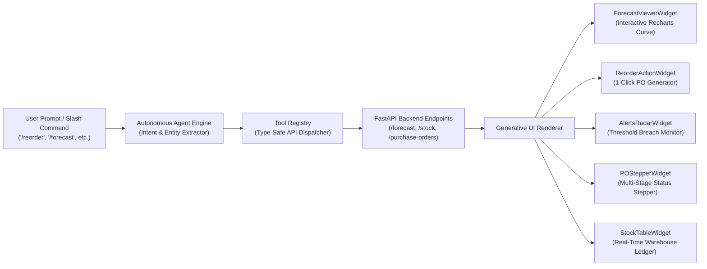
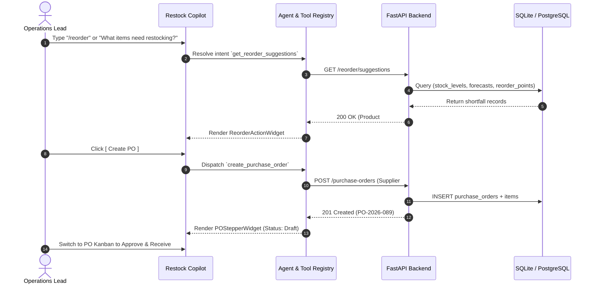
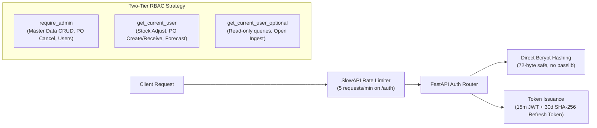
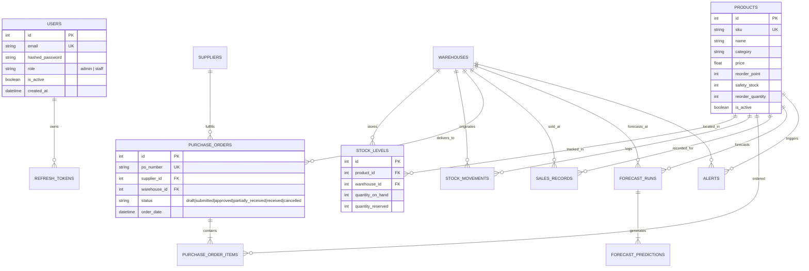

<div align="center">

# Restock

**The Modern AI-Powered Inventory & Demand Forecasting Operating System**

[](https://github.com/taherali181/restock)
[](https://fastapi.tiangolo.com)
[](https://reactjs.org)
[](https://tailwindcss.com)
[](https://python.org)
[](https://www.sqlalchemy.org)
[](https://pytest.org)
[](LICENSE)

<p align="center">
  <a href="#-quickstart-in-60-seconds">⚡ Quickstart</a> •
  <a href="#-why-restock">💡 Why Restock?</a> •
  <a href="#-the-dual-canvas-experience">✨ Dual-Canvas UX</a> •
  <a href="#-interactive-copilot--generative-ui">🤖 AI Copilot</a> •
  <a href="#-context-studio-workspaces">📊 Studio Workspaces</a> •
  <a href="#-multi-model-demand-forecasting-engine">📈 ML Forecasting</a> •
  <a href="#-concurrency-reliability--data-integrity">🛡️ Concurrency & Reliability</a> •
  <a href="#-api-reference">🔌 API Reference</a> •
  <a href="#-database-schema">🗄️ Database Schema</a>
</p>

</div>

---

```
   ____           __             __  
  / __ \___  ___ / /____  ____  / /__
 / /_/ / _ \(_-</ __/ _ \/ __/ /  '_/
/_/ \_\___/___/\__/\___/\__/  /_/\_\ 
  Autonomous Supply Chain Intelligence • Dual-Canvas Workspace • Predictive ML
```

**Restock** is a production-grade, AI-first inventory operating system built for modern supply chain and operations teams. It seamlessly fuses **conversational AI intelligence** with a **high-density interactive studio workspace**—eliminating stockouts, predicting future demand with multi-model machine learning, and automating procurement workflows from low-stock triage to atomic warehouse receiving.

> [!TIP]
> **Instant Demo Access**: Launch with Docker Compose in 60 seconds. An administrator demo account (`admin@restock.io` / `Password123!`) is available out of the box.

---

## ⚡ Quickstart in 60 Seconds

### Demo Credentials

| Field | Demo Value |
| :--- | :--- |
| **Email** | `admin@restock.io` |
| **Password** | `Password123!` |
| **Role** | System Administrator (`admin`) |

---

### Option A: Docker Compose (Recommended)

Run the complete multi-tier system (FastAPI backend + React frontend + persistent SQLite volume) with a single command:

```bash
# Clone the repository
git clone https://github.com/taherali181/restock.git
cd restock

# Launch all containers
docker compose up --build
```

- **Frontend Studio & AI Copilot**: [http://localhost:3000](http://localhost:3000)
- **Interactive Backend Swagger Docs**: [http://localhost:8000/docs](http://localhost:8000/docs)
- **Prometheus Telemetry Metrics**: [http://localhost:8000/metrics](http://localhost:8000/metrics)

---

### Option B: Local Developer Setup

#### 1. Backend Setup (FastAPI & Python 3.11+)

```bash
cd backend

# Create and activate virtual environment
python3 -m venv .venv
source .venv/bin/activate

# Install dependencies
pip install -r ../requirements.txt

# Configure environment & apply Alembic migrations
cp .env.example .env
alembic upgrade head

# Run FastAPI server with auto-reload
uvicorn main:app --reload --port 8000
```

#### 2. Frontend Setup (React 18 & Tailwind CSS)

```bash
cd frontend

# Install dependencies
npm install

# Configure local environment (defaults to http://127.0.0.1:8000)
cp .env.example .env.local

# Start development server
npm start
```

Open [http://localhost:3000](http://localhost:3000) in your browser.

---

## 💡 Why Restock?

Traditional Enterprise Resource Planning (ERP) and inventory management tools force supply chain operators to navigate fragmented menus, manually compute reorders in error-prone spreadsheets, and guess future demand with crude averages.

Restock replaces static CRUD forms with a **fluid, dual-speed operating system**:

| Capability | Legacy Inventory Tools | The Restock OS |
| :--- | :--- | :--- |
| **Demand Forecasting** | Static moving averages or arbitrary reorder formulas | **3 Production ML Models** (Random Forest with recursive lags, Holt-Winters ETS, and moving average baseline) with multi-horizon evaluation |
| **Workflow Velocity** | 10+ clicks across 4 disconnected screens to issue a PO | **Conversational Copilot** with 1-Click Generative UI action cards and inline PO creation |
| **Stockout Visibility** | Discovered only after backorders and fulfillment delays | **Proactive Alerts Radar** & automated reorder shortfall suggestions computed against future demand |
| **Workspace Ergonomics** | Clunky, dated enterprise forms | **Ultra-Clean Minimalist UI** (Linear/Vercel-inspired Obsidian/Zinc design tokens, 1px micro-borders, Framer Motion springs) |
| **Data Integrity** | Prone to lost updates during simultaneous stock writes | **Deterministic In-Process Locks (`stock_level_lock`)**, DB pessimistic locks, deadlock prevention, and immutable movement logs |
| **Audit & Governance** | Opaque database mutations | **Full Historical Audit Trail**, batched CSV validation summaries, and two-tier RBAC authorization |

---

## 🖥️ The Dual-Canvas Experience

Restock features a responsive **Dual-Canvas Layout** engineered for operational agility:
1. **Left Canvas: Autonomous Copilot & Generative UI** — Query data, execute slash commands, trigger ML runs, and approve purchase orders via natural conversation.
2. **Right Canvas: Context Studio Workspaces** — High-density, real-time interactive sandboxes for executive KPIs, inventory DataGrids, multi-model forecast comparisons, PO Kanban boards, and sales EDA.

```
+-------------------------------------------------------------------------------------------------------------+
|  RESTOCK  [ ⌘K Omnibar / Fast Search ]                      Status: Healthy  •  Alerts: 3  •  [ Demo Admin ]  |
+----------------------------------------------------+--------------------------------------------------------+
|  🤖 CONVERSATIONAL AI COPILOT                      |  📊 CONTEXT STUDIO WORKSPACE                           |
|                                                    |  [ Dashboard ] [ Inventory ] [ Forecast ] [ POs ]      |
|  User: "/reorder"                                  |                                                        |
|                                                    |  📦 Master Inventory & Stock Levels                    |
|  AI: "Found 2 items below safety threshold:        |  +--------------------------------------------------+  |
|  ┌──────────────────────────────────────────────┐  |  | Product      Warehouse  On Hand  Avail   Status     |  |
|  │ Reorder Suggestion · Product #101            │  |  |--------------------------------------------------|  |
|  │ Stock: 14 | Forecast: 82 | Shortfall: +68    │  |  | Widget Pro   Main Hub   14       14      ⚠️ Low     |  |
|  │ [ Approve PO (PO-2026-089) ]                 │  |  | Ultra Sensor West WH    240      210     ✅ Normal  |  |
|  └──────────────────────────────────────────────┘  |  +--------------------------------------------------+  |
|                                                    |                                                        |
|  User: "/forecast 101 --horizon 30"                |  📈 Multi-Model Demand Sandbox (SKU #101)              |
|  AI: "Trained Random Forest model (MAE: 2.14).     |    120 ┤          ╭───╮  Random Forest (P50)           |
|  Predicted demand over 30 days: 82 units."         |     80 ┤    ╭─────╯   ╰────── Exponential Smoothing    |
|                                                    |     40 ┤────╯                 Moving Average Baseline  |
|  [ 💬 Ask Copilot or type /alerts, /stock, /po... ]|      0 └───────────────────────────────────────        |
+----------------------------------------------------+--------------------------------------------------------+
```

---

## 🤖 Interactive Copilot & Generative UI

The conversational Copilot does not just output text—it dynamically injects **rich, interactive generative UI widgets** directly into the conversation stream. Each widget is wired directly to backend FastAPI operations.



### Generative UI Widget Showcase

- **`ForecastViewerWidget`**: Renders dynamic forecast curves comparing multiple ML algorithms, displays forecast horizons (7 to 90 days), and overlays historical actuals alongside MAE/RMSE error metrics.
- **`ReorderActionWidget`**: Displays calculated supply shortfalls ($\text{Current Stock} - \text{Forecasted Demand} < \text{Reorder Point}$) and includes a 1-click **"Create PO"** action that optimistically dispatches procurement orders.
- **`AlertsRadarWidget`**: Proactively flags low-stock threshold breaches with urgency badges and one-touch triage links.
- **`POStepperWidget`**: Multi-step visual lifecycle tracker (`Draft` &rarr; `Submitted` &rarr; `Approved` &rarr; `Received`) with instant status transitions.
- **`StockTableWidget`**: Inline snapshot of warehouse on-hand vs. available quantities with healthy/warning status pills.
- **`KPISummaryWidget`**: Instant 4-metric executive snapshot (turnover ratio, stockout percentage, forecast accuracy MAPE, total units on hand).
- **`EDAOverviewWidget`**: Summarizes newly ingested sales CSV datasets with dataset profiling statistics and server-rendered distribution charts.

---

## ⌨️ Command Palette & Slash Commands

Restock is designed for keyboard-first navigation. Press <kbd>Ctrl</kbd> + <kbd>K</kbd> (or <kbd>Cmd</kbd> + <kbd>K</kbd>) anywhere to open the Omnibar:

```
┌────────────────────────────────────────────────────────┐
│  🔍  Search or jump to...                     [ESC]    │
├────────────────────────────────────────────────────────┤
│  GO TO                                                 │
│  📈  Demand forecast             Planning      Jump →  │
│  📦  Inventory and stock levels Operations    Jump →  │
│  🛒  Purchase orders             Procurement   Jump →  │
│  🛡️  Low-stock alerts            Monitoring    Jump →  │
│  📊  Sales analysis (EDA)        Data          Jump →  │
│  ⚡  Executive Dashboard         Overview      Jump →  │
└────────────────────────────────────────────────────────┘
```

### Slash Commands Cheatsheet

| Slash Command | Description | Generative UI Output |
| :--- | :--- | :--- |
| `/alerts` | Scan all warehouses for active low-stock breaches | `AlertsRadarWidget` with risk metrics & triage |
| `/reorder` | Compute reorder suggestions based on demand shortfall | `ReorderActionWidget` with 1-click PO creation |
| `/forecast [sku]` | Schedule or retrieve future demand forecast curves | `ForecastViewerWidget` with multi-model overlays |
| `/stock [sku]` | Query current on-hand & available quantities across hubs | `StockTableWidget` with warehouse breakdown |
| `/po` | View open purchase orders and transit statuses | `POStepperWidget` with delivery timelines |
| `/kpi [days]` | Compute turnover ratio, stockout rate, and accuracy | `KPISummaryWidget` with 30-day velocity stats |
| `/eda` | Load statistical distribution metrics from recent CSV uploads | `EDAOverviewWidget` with visual chart previews |

---

## 📊 Context Studio Workspaces

The right-hand workspace provides dedicated, high-performance operational consoles that stay synchronized with your active session:

### 1. Executive KPI Dashboard (`/dashboard`)
- **Inventory Turnover Ratio**: Real-time sales velocity divided by current on-hand inventory ($\frac{\sum \text{Sales}_{30\text{d}}}{\text{Total On-Hand}}$).
- **Stockout Rate**: Exact percentage of tracked product-warehouse pairs currently at zero available stock ($\frac{N_{\text{zero}}}{N_{\text{total}}} \times 100$).
- **Forecast Accuracy Tracking**: Mean Absolute Percentage Error (MAPE) and Mean Absolute Error (MAE) evaluated against real ground-truth sales records.
- **Sales vs. On-Hand Comparison**: Visual volume comparison across configurable periods (7, 30, or 90 days).

### 2. Master Inventory & Stock Levels (`/inventory`)
- High-density virtualized DataGrid with instantaneous SKU code, product name, and warehouse filtering.
- Visual stock health indicators (Healthy vs. Low-Stock).
- **Interactive Stock Adjustment Modal**: Adjust inventory quantities with structured movement tags (`cycle_count`, `damage_writeoff`, `inbound_discrepancy`, `internal_transfer`) and instant optimistic ledger updates.

### 3. Demand Forecasting & Model Sandbox (`/forecast`)
- **3 Production Algorithms**:
  - **Random Forest Regressor**: Feature-engineered with `lag_1`, `lag_7`, `rolling_mean_7`, `rolling_mean_28`, day-of-week, month cyclical encoding, and calendar holiday flags. Recursive multi-step future forecasting.
  - **Exponential Smoothing (ETS / Holt-Winters)**: Daily resampled time series modeling with configurable gap-fill strategies (`zero` vs. `interpolate`).
  - **Moving Average Baseline**: Rolling window benchmark for baseline comparison.
- Interactive Horizon Slider (7 to 90 calendar days).
- Multi-Model Overlay: Compare predictions from all trained models simultaneously on a single unified chart.

### 4. Purchase Order Kanban Workflow (`/purchase-orders`)
- Drag-and-drop / 1-click status advancement across the full procurement lifecycle:
  `Drafts` &rarr; `Submitted` &rarr; `Approved / In-Transit` &rarr; `Received` (or `Cancelled`).
- **Partial Receiving Support**: Receive outstanding line items incrementally with automatic atomic inventory updates and stock movement logging.

### 5. Low-Stock Alert Triage (`/alerts`)
- Continuous inventory monitoring comparing available quantities against product-specific reorder points and safety stock levels.
- **1-Click Recompute**: Recalculates thresholds across all SKUs, auto-resolves recovered inventory, and triggers background email notifications via SMTP.

### 6. Sales EDA & Data Ingestion (`/eda` & `/upload`)
- Drag-and-drop ingestion of legacy sales CSV files (`date, store, item, sales`).
- Automatic entity bridging (creates legacy warehouses & products on the fly).
- Server-side Matplotlib/Seaborn statistical profiling: sales trend line, correlation matrix heatmap, sales distribution histogram, and boxplot outliers.

---

## 🔄 End-to-End Operational Workflow



---

## 📈 Multi-Model Demand Forecasting Engine

Restock provides a modular demand forecasting subsystem operating directly over the normalized `sales_records` table, scoped to distinct `(product_id, warehouse_id)` tuples.

```mermaid
graph TD
    A[Sales Records in DB] --> B{Sufficient History? Count >= 10}
    B -- No --> C[Raise InsufficientHistoryError / HTTP 400]
    B -- Yes --> D[Load & Sort Historical DataFrame]
    
    D --> E{Selected Model Type}
    
    subgraph RF ["Random Forest Pipeline"]
        E -- "random_forest" --> RF1[Reindex to Continuous Daily Index asfreq('D')]
        RF1 --> RF2[Generate Lag Features: lag_1, lag_7]
        RF2 --> RF3[Generate Rolling Means: 7d, 28d min_periods=1]
        RF3 --> RF4[Engineer Date Features: Sin/Cos Month, Holidays, Weekend]
        RF4 --> RF5[Drop Initial 7 Cold-Start NaN Rows]
        RF5 --> RF6[Split 80/20 Holdout -> Fit Eval RF -> Compute RMSE/MAE]
        RF6 --> RF7[Refit Final RF on 100% History]
        RF7 --> RF8[Recursive Multi-Step Prediction Loop for Horizon Days]
    end
    
    subgraph ES ["Exponential Smoothing Pipeline"]
        E -- "exponential_smoothing" --> ES1[Reindex to Daily Series asfreq('D')]
        ES1 --> ES2{Gap Fill Strategy}
        ES2 -- "zero" --> ES3[Fill NaN gaps with 0.0]
        ES2 -- "interpolate" --> ES4[Interpolate linear sales across gaps]
        ES3 --> ES5[Fit ExponentialSmoothing Statsmodels additive trend]
        ES4 --> ES5
        ES5 --> ES6[Forecast Horizon Steps Forward]
    end
    
    subgraph MA ["Moving Average Pipeline"]
        E -- "moving_average" --> MA1[Reindex to Daily Series asfreq('D')]
        MA1 --> MA2[Compute Trailing 7-Day Rolling Mean]
        MA2 --> MA3[Project Final Rolling Mean Constant Across Horizon]
    end

    RF8 --> CLIP[Universal Non-Negative Floor: max 0.0, y]
    ES6 --> CLIP
    MA3 --> CLIP
    CLIP --> PERSIST[Persist Model to Disk / Save Predictions to DB]
```

### 1. Mathematical Feature Engineering

The temporal feature pipeline transforms raw timestamp data into structured feature vectors:

$$\text{month\_sin} = \sin\left(\frac{2\pi \cdot \text{month}}{12}\right), \quad \text{month\_cos} = \cos\left(\frac{2\pi \cdot \text{month}}{12}\right)$$

$$\text{is\_weekend} = \mathbb{I}(\text{day\_of\_week} \in \{5, 6\})$$

$$\text{is\_holiday} = \mathbb{I}(\text{date} \in \text{Holidays}_{\text{country}}(\text{years}))$$

> [!NOTE]
> **Holiday Calendar Evaluation**:
> Eager holiday calendar expansion (`years=list(range(min_year, max_year + 1))`) resolves lazy-loading issues, and strict date typing (`dates.dt.date`) ensures robust holiday flag identification.

### 2. Model Archetypes & Algorithms

1. **Random Forest Regressor (`random_forest`)**:
   - `RandomForestRegressor(n_estimators=200, random_state=42)` trained on lag terms ($\text{lag}_1, \text{lag}_7$) and rolling averages ($\text{roll}_7, \text{roll}_{28}$).
   - **Cold-Start Handling**: Rolling means use `min_periods=1` to allow model training with history lengths down to `MIN_HISTORY_ROWS=10`.
   - **Recursive Multi-Step Forecasting**: Future projections use iterative walk-forward prediction where day $t$'s prediction updates the lag and rolling window for day $t+1$.
2. **Holt-Winters Exponential Smoothing (`exponential_smoothing`)**:
   - Additive trend modeling from `statsmodels.tsa.holtwinters`.
   - Configurable gap-fill strategies: `"zero"` (default retail assumption) vs `"interpolate"`.
3. **Moving Average Baseline (`moving_average`)**:
   - Trailing 7-day walk-forward window benchmark.

### 3. Model Persistence & Evaluation

- **Zero-Retrain Retrieval**: Fitted models serialize to disk (`backend/data/models/{run_id}.joblib`), while predictions persist in `forecast_predictions`. Subsequent reads via `GET /forecast/{id}` return cached predictions instantly.
- **Universal Non-Negative Floor**: All raw model outputs are clipped to $\max(0.0, \hat{y})$.
- **Holdout Validation**: 80/20 train/test split computes out-of-sample RMSE and MAE:

$$\text{RMSE} = \sqrt{\frac{1}{N} \sum_{i=1}^N (y_i - \hat{y}_i)^2}, \quad \text{MAE} = \frac{1}{N} \sum_{i=1}^N |y_i - \hat{y}_i|$$

---

## 🛡️ Concurrency, Reliability & Data Integrity

Restock is engineered with defensive concurrency controls to ensure data integrity during simultaneous stock writes:

```
+-------------------------------------------------------------------------------------------------------------+
|                                    CONCURRENCY THREAT MITIGATION MATRIX                                     |
+---------------------------+-----------------------------------+---------------------------------------------+
| Concurrency Threat        | Vulnerability Window              | Restock Defensive Implementation            |
+---------------------------+-----------------------------------+---------------------------------------------+
| Lost Updates on Stock     | Concurrent stock adjustments or   | In-process threading lock (stock_level_lock)|
| Increment / Decrement     | receipts reading stale quantities | held from read through commit + FOR UPDATE  |
+---------------------------+-----------------------------------+---------------------------------------------+
| Insert Collision Race     | Two threads concurrently creating | Handled via IntegrityError catch and        |
| on New StockLevel Row     | first StockLevel for a product/WH | automatic retry in get_or_create_stock_level|
+---------------------------+-----------------------------------+---------------------------------------------+
| Deadlocks during          | Multiple threads receiving POs    | Product IDs sorted before acquisition       |
| Multi-SKU PO Receipts     | with overlapping SKUs in reverse  | using ExitStack lock sequencing             |
+---------------------------+-----------------------------------+---------------------------------------------+
| Stale Identity Map Caches | Re-reading items already loaded   | Mandatory .populate_existing() call on      |
| in SQLAlchemy Session     | in the same database session      | all re-queried concurrent records           |
+---------------------------+-----------------------------------+---------------------------------------------+
| SQLite ALTER TABLE Limits | Schema migrations attempting to   | Alembic configured with                     |
| during DB Upgrades        | drop/modify columns in SQLite     | render_as_batch=True                        |
+---------------------------+-----------------------------------+---------------------------------------------+
| DB Session Leaks in       | Background tasks inheriting       | Explicit import database; SessionLocal()    |
| Async Background Tasks    | closed HTTP request session       | pattern with try...finally session closing  |
+---------------------------+-----------------------------------+---------------------------------------------+
```

### Deadlock Prevention via Sorted Lock Acquisition

When receiving purchase orders containing multiple line items, locks are acquired in sorted product ID order using `contextlib.ExitStack`:

```python
# Prevent deadlocks by sorting product IDs before acquiring locks
sorted_product_ids = sorted(list(product_ids))
with ExitStack() as stack:
    for pid in sorted_product_ids:
        stack.enter_context(stock_level_lock(pid, warehouse_id))
    # Execute atomic receiving and commit
    db.commit()
```

---

## 🔐 Security, Auth & RBAC Architecture

Restock implements an enterprise-grade security model:



- **JWT Access & Refresh Token Rotation**: 15-minute access tokens paired with 30-day high-entropy opaque refresh tokens (SHA-256 hashed at rest).
- **Direct Bcrypt Password Hashing**: Hashing uses `bcrypt` directly with a strict 72-byte Pydantic boundary, avoiding `passlib` truncation bugs.
- **Fail-Safe Startup Verification**: If `ENVIRONMENT=production` and `JWT_SECRET_KEY` remains on the default secret, the server refuses to boot.
- **Transparent 401 Auto-Refresh**: Axios interceptor silently exchanges expired tokens via `/auth/refresh` and replays pending requests without UI interruption.

---

## 🗄️ Database Schema

The database model is managed via version-controlled **Alembic** migrations:



---

## 🔌 API Reference

Restock exposes a fully documented, type-safe REST API at `/docs`. Below is a comprehensive reference of all endpoints:

### Authentication & Users
| Method | Endpoint | Auth | Purpose |
| :--- | :--- | :--- | :--- |
| `POST` | `/auth/register` | Open (Rate-limited) | Register new user account (defaults to `staff` role) |
| `POST` | `/auth/login` | Open (Rate-limited) | Authenticate user; returns JWT access + refresh tokens |
| `POST` | `/auth/refresh` | Open | Exchange valid refresh token for a new access token |
| `POST` | `/auth/logout` | Open | Revoke active refresh token |
| `GET` | `/auth/me` | Authenticated | Return identity and role of currently authenticated user |
| `GET` | `/users` | `require_admin` | List all users (`skip`, `limit` pagination) |
| `PATCH` | `/users/{id}/role` | `require_admin` | Update user role (`admin` or `staff`) |
| `PATCH` | `/users/{id}/deactivate` | `require_admin` | Soft-deactivate a user account |

### Master Data (Products, Warehouses, Suppliers)
| Method | Endpoint | Auth | Purpose |
| :--- | :--- | :--- | :--- |
| `GET` | `/products` | Open | Paginated product list (`?search=`, `skip`, `limit`) |
| `POST` | `/products` | `require_admin` | Create new SKU product catalog entry |
| `GET` | `/products/export` | Open | Stream product catalog as CSV |
| `GET` | `/products/{id}` | Open | Retrieve product by ID |
| `PUT` | `/products/{id}` | `require_admin` | Update product details and reorder thresholds |
| `DELETE`| `/products/{id}` | `require_admin` | Soft-deactivate product |
| `GET` | `/warehouses` | Open | List warehouses (`?search=`, `skip`, `limit`) |
| `POST` | `/warehouses` | `require_admin` | Create new warehouse facility |
| `PUT` | `/warehouses/{id}` | `require_admin` | Update warehouse details |
| `DELETE`| `/warehouses/{id}` | `require_admin` | Soft-deactivate warehouse |
| `GET` | `/suppliers` | Open | List suppliers (`?search=`, `skip`, `limit`) |
| `POST` | `/suppliers` | `require_admin` | Create new supplier record |
| `PUT` | `/suppliers/{id}` | `require_admin` | Update supplier details |
| `DELETE`| `/suppliers/{id}` | `require_admin` | Soft-deactivate supplier |

### Stock Levels & Audit Movements
| Method | Endpoint | Auth | Purpose |
| :--- | :--- | :--- | :--- |
| `GET` | `/stock` | Open | List paginated stock levels across warehouses |
| `POST` | `/stock/adjust` | Authenticated | Atomically adjust inventory with audit movement tagging |
| `GET` | `/stock/movements` | Open | Query immutable audit log of inventory movements |

### Purchase Orders & Procurement
| Method | Endpoint | Auth | Purpose |
| :--- | :--- | :--- | :--- |
| `GET` | `/purchase-orders` | Open | Paginated list of purchase orders with line items |
| `POST` | `/purchase-orders` | Authenticated | Create new draft purchase order |
| `GET` | `/purchase-orders/export` | Open | Stream purchase orders as CSV |
| `GET` | `/purchase-orders/{id}` | Open | Retrieve single purchase order with line items |
| `PUT` | `/purchase-orders/{id}/status` | Authenticated* | Transition PO state (`submitted`, `approved`, `cancelled`*) |
| `POST` | `/purchase-orders/{id}/receive`| Authenticated | Receive partial or full quantities; atomically increments stock |

*\*Note: Cancelling a purchase order requires `admin` role.*

### Demand Forecasting & Replenishment
| Method | Endpoint | Auth | Purpose |
| :--- | :--- | :--- | :--- |
| `POST` | `/forecast` | Open | Schedule background ML training run for (Product, Warehouse) |
| `GET` | `/forecast` | Open | List past forecast runs (`product_id`, `warehouse_id`) |
| `GET` | `/forecast/compare` | Open | Compare most recent run across all 3 model types |
| `GET` | `/forecast/{id}` | Open | Retrieve cached predictions and evaluation metrics |
| `GET` | `/reorder/suggestions` | Open | Compute replenishment shortfalls against predicted demand |

### Ingestion, EDA & Telemetry
| Method | Endpoint | Auth | Purpose |
| :--- | :--- | :--- | :--- |
| `POST` | `/upload` | Open | Upload historical sales CSV (`date, store, item, sales`) |
| `GET` | `/upload/history` | Open | Paginated list of historical dataset uploads |
| `GET` | `/eda` | Open | Retrieve Matplotlib/Seaborn statistical charts and summaries |
| `GET` | `/alerts` | Open | List open low-stock alerts |
| `POST` | `/alerts/recompute` | Open | Recompute inventory threshold breaches & trigger alerts |
| `GET` | `/dashboard/kpis` | Open | Compute turnover ratio, stockout rate, and forecast accuracy |
| `GET` | `/health` | Open | Active database connectivity health check (`SELECT 1`) |
| `GET` | `/metrics` | Open | Prometheus exposition format telemetry metrics |

---

## 🧪 Testing & Quality Assurance

Restock maintains strict test coverage across backend services and frontend components:

```bash
# Run Backend Pytest Suite (99 Tests Passing)
cd backend
pytest

# Verify Alembic Migration Schema Consistency
alembic check

# Run Frontend Jest Test Suite (18 Tests Passing)
cd ../frontend
npm test -- --watchAll=false

# Test Production Bundle Compilation
npm run build
```

---

## ⚙️ Configuration Matrix

### Backend Configuration (`backend/.env`)

| Variable | Default Value | Description |
| :--- | :--- | :--- |
| `DATABASE_URL` | `sqlite:///data/inventory.db` | SQLAlchemy connection string (SQLite or PostgreSQL) |
| `JWT_SECRET_KEY` | `dev-insecure-secret-key...` | Cryptographic secret for JWT signing (**override in production**) |
| `ENVIRONMENT` | `development` | Deployment environment (`development` or `production`) |
| `HOLIDAY_COUNTRY` | `IN` | Country code for calendar feature engineering (`US`, `IN`, `GB`) |
| `ALERT_NOTIFICATION_EMAILS` | `""` | Comma-separated email addresses for low-stock alerts |
| `SMTP_HOST` | `""` | Outbound SMTP server hostname |
| `SMTP_PORT` | `587` | Outbound SMTP server port |
| `SMTP_USERNAME` | `""` | SMTP authentication username |
| `SMTP_PASSWORD` | `""` | SMTP authentication password |
| `DB_POOL_SIZE` | `5` | Connection pool size for non-SQLite database drivers |
| `DB_MAX_OVERFLOW` | `10` | Max overflow connections for non-SQLite database drivers |

### Frontend Configuration (`frontend/.env.local`)

| Variable | Default Value | Description |
| :--- | :--- | :--- |
| `REACT_APP_API_BASE_URL` | `http://127.0.0.1:8000` | Backend API base URL for Axios client requests |

---

## 📁 Repository Structure

```
restock/
├── backend/
│   ├── alembic/                # Version-controlled database migrations
│   ├── routers/                # 14 Modular FastAPI resource routers
│   ├── auth.py                 # Direct bcrypt hashing & JWT token handling
│   ├── config.py               # Pydantic BaseSettings configuration
│   ├── database.py             # SQLAlchemy session factory & connection pooling
│   ├── forecasting.py          # Machine learning multi-model training & inference
│   ├── ingest.py               # CSV sales ingestion & batched normalization
│   ├── logging_config.py       # JSON structured logging formatter
│   ├── models.py               # SQLAlchemy ORM declarative models
│   ├── schemas.py              # Pydantic request/response validation schemas
│   ├── stock_ops.py            # Thread-safe atomic stock adjustment operations
│   └── tests/                  # Pytest test suite (99 passing tests)
│
├── frontend/
│   ├── src/
│   │   ├── ai/                 # Autonomous agent engine & tool registry
│   │   ├── api/                # Axios API resource clients & 401 retry interceptor
│   │   ├── charts/             # Recharts theme tokens & chart styling
│   │   ├── components/
│   │   │   ├── chat/           # Copilot stream, input, & Generative UI widgets
│   │   │   ├── studio/         # High-density Studio workspaces (Dashboard, POs, etc.)
│   │   │   ├── shell/          # Topbar, Sidebar, Omnibar (Cmd+K), AppShell
│   │   │   └── ui/             # Reusable UI atoms (Buttons, Badges, Modals, Tables)
│   │   ├── context/            # AuthContext (JWT session state & auto-restore)
│   │   ├── store/              # Zustand global workspace store
│   │   └── pages/              # Route views (Login, Register, Legacy fallbacks)
│   ├── tailwind.config.js      # Design token system & monochrome palette
│   └── package.json            # Node.js dependencies & Jest module mappings
│
├── docs/                       # Architectural documentation & upgrade roadmaps
├── docker-compose.yml          # Multi-container production orchestration
└── requirements.txt            # Python dependencies
```

---

## 📄 License

This project is licensed under the **MIT License** — see the [LICENSE](LICENSE) file for details.

<div align="center">
  <sub>Built with precision for modern supply chains. Crafted with FastAPI, React, and Machine Learning.</sub>
</div>
