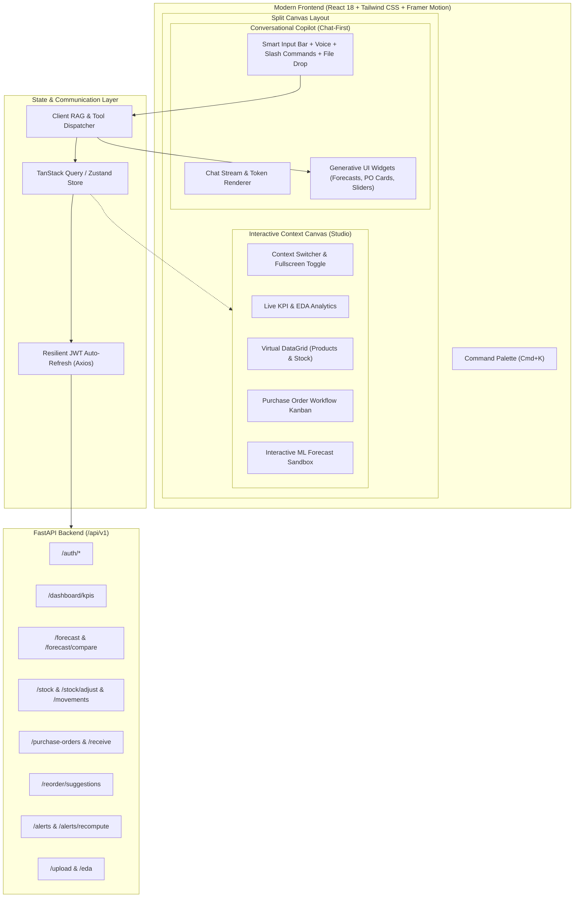
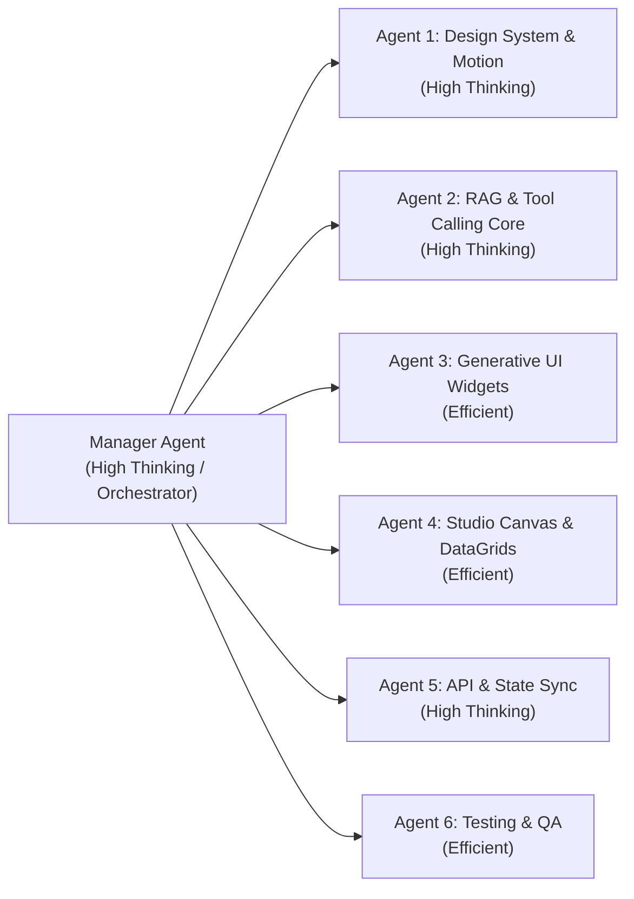

# Restock: Next-Gen RAG Chatbot-First Frontend Architecture & Claude Execution Plan

## 1. Executive Summary & Vision

This master blueprint details the complete overhaul of the **Restock** frontend. The application will evolve from a traditional, static multi-page CRUD dashboard into an **AI-First Intelligent Supply Chain Copilot & Interactive Canvas**.

### Key Highlights
- **Chatbot-First Conversational Core**: A natural language assistant equipped with autonomous Tool/Function Calling against the FastAPI backend (`/reorder`, `/forecast`, `/stock`, `/purchase-orders`, `/alerts`, `/dashboard`).
- **Generative UI & Rich Interactive Widgets**: The chat stream doesn't just return plain text—it dynamically embeds interactive forecast charts, one-click purchase order approval cards, inventory sliders, and real-time alert chips.
- **Responsive Dual-Canvas Layout**:
  - **Left / Center**: Conversational Stream with prompt suggestions, slash commands (`/forecast`, `/reorder`, `/stock`, `/po`), file drag-and-drop ingestion, and voice/audio input toggle.
  - **Right Canvas / Sidekick Drawer**: Context-Aware Studio Canvas (Interactive Demand Forecast Sandbox, PO Kanban, Dynamic DataGrid, EDA Visualizer) that syncs dynamically with the active conversation.
- **Ultra-Modern Visual Aesthetics & Motion**: Modern glassmorphic dark/light design system, glowing state accents, Framer Motion layout transitions (`layoutId`), fluid message streaming, and micro-interactions.

---

## 2. System Architecture & Component Hierarchy



---

## 3. Technology Stack & Modern UI Specifications

| Layer | Recommended Technology | Rationale |
|---|---|---|
| **Framework** | **React 18** (or Next.js 14 / Vite SPA) | Concurrent rendering, fast HMR, streaming UI support |
| **Styling & Design** | **Tailwind CSS v3.4+** + **Tailwind Animate** | Utility-first, clean token system, seamless dark mode |
| **Animation Engine** | **Framer Motion** | Physics-based spring animations, layout transitions (`layoutId`), stagger effects |
| **Component Primitives** | **Radix UI** / **Headless UI** + **Lucide Icons** | Fully accessible, unstyled primitives for modals, popovers, dropdowns |
| **Charts & Visualizations** | **Recharts** + **Chart.js** | Area gradients, confidence intervals (P10/P50/P90), brush zooming, responsive sizing |
| **State & Data Fetching** | **TanStack Query v5** + **Zustand** | Automatic caching, background refetching, optimistic updates, minimal boilerplate |
| **HTTP & Session** | **Axios** (with resilient 401 retry interceptor) | Preserves existing robust token refresh architecture |

---

## 4. Multi-Agent Claude Execution Team

To execute this overhaul reliably, work is divided across a coordinated multi-agent team with distinct roles, thinking budgets, and responsibilities.



### Agent Roles & Specifications

| Agent | Tier | Role & Core Responsibilities |
|---|---|---|
| **Manager Agent** | High Thinking | **Orchestrator & Architecture Guardian**: Coordinates task dependencies, verifies contract compatibility between agents, reviews code diffs, ensures no domain regression. |
| **Agent 1** | High Thinking | **Design System & Motion Architect**: Configures Tailwind CSS, theme tokens (Obsidian Dark / Crisp Light), Framer Motion layout animations, glassmorphism cards, command palette (`Cmd+K`), and sound/haptics engine. |
| **Agent 2** | High Thinking | **RAG & Tool Calling Engine Lead**: Implements the conversational orchestrator, intent recognition, client-side RAG index (product catalog, warehouse statuses, FAQs), LLM tool execution registry, and streaming token renderer. |
| **Agent 3** | Efficient | **Generative UI Component Specialist**: Builds embeddable chat widgets: `ForecastChartCard`, `ReorderActionCard`, `StockAdjustSlider`, `AlertRadarChip`, `POLifecycleStepper`, and `UploadDropzoneCard`. |
| **Agent 4** | Efficient | **Studio Canvas & DataGrid Specialist**: Implements the right-hand context studio: virtualized DataGrid for Products/Stock, interactive Forecast comparison playground, PO Kanban board, and EDA chart explorer. |
| **Agent 5** | High Thinking | **State & Network Resilience Engineer**: Manages TanStack Query stores, Zustand state slices, Axios JWT interceptors with retry queuing, polling managers for background forecast/EDA jobs, and error boundaries. |
| **Agent 6** | Efficient | **Test & Quality Assurance Specialist**: Creates unit and integration tests (Jest, React Testing Library), visual regression checks, mock API handlers (MSW), and verifies build/bundle performance. |

---

## 5. Phase-by-Phase Claude Implementation Roadmap

### Phase 1: Foundation, Dependencies & Theme System (Agent 1 + Agent 5)
1. **Dependencies Installation**:
   - Install `tailwindcss`, `postcss`, `autoprefixer`, `framer-motion`, `lucide-react`, `@radix-ui/react-*`, `@tanstack/react-query`, `zustand`, `clsx`, `tailwind-merge`.
2. **Design Tokens & Theme Setup**:
   - Set up `tailwind.config.js` with sleek dark mode palette (`slate-950`, `zinc-900`, `indigo-500`, `violet-500`, `emerald-500`, `rose-500`).
   - Define custom glassmorphism utilities (`backdrop-blur-md`, `border-white/10`, `shadow-glow`).
3. **Audio/Haptics Feedback Helpers**:
   - Micro-sound effects (subtle click, success chime, alert tone) with mute toggle.

### Phase 2: Core Shell, Split-Canvas & Omnibar (Agent 1 + Agent 4)
1. **App Shell Architecture**:
   - Responsive layout supporting `Chat-Only`, `Split-View` (Chat + Studio Canvas), and `Full Studio` modes.
   - Fluid collapsible navigation sidebar with real-time KPI pill badges.
2. **Command Palette (`Cmd+K`)**:
   - Instant search across Products, Warehouses, Suppliers, POs, and Quick Actions (`/forecast`, `/reorder`, `/stock-adjust`).
3. **Notification Hub**:
   - Slide-over notification panel with real-time alert badges, stockout warnings, and background job notifications.

### Phase 3: Conversational RAG & Tool Execution Engine (Agent 2 + Agent 5)
1. **Chat Orchestration Layer**:
   - Multi-turn conversation state with persistent history (LocalStorage / IndexedDB).
   - Slash command dispatcher (`/reorder`, `/forecast <sku>`, `/stock <warehouse>`, `/po <id>`).
2. **Backend Tool Calling Registry**:
   - Maps natural language intents and structured tool calls to backend endpoints:
     - `get_stock_status(product_id, warehouse_id)` -> `GET /stock`
     - `get_reorder_suggestions()` -> `GET /reorder/suggestions`
     - `run_forecast(product_id, warehouse_id, model_type, horizon)` -> `POST /forecast`
     - `adjust_stock(product_id, warehouse_id, quantity_delta, reason)` -> `POST /stock/adjust`
     - `create_purchase_order(supplier_id, warehouse_id, items)` -> `POST /purchase-orders`
     - `get_kpis(period_days)` -> `GET /dashboard/kpis`
3. **Client-Side Semantic Search / RAG Index**:
   - In-memory trie and fuzzy embeddings index for instantaneous product/supplier search and contextual prompt auto-complete.

### Phase 4: Generative UI Chat Widgets & Interactions (Agent 3)
1. **`ForecastWidget`**:
   - Inline interactive forecast curve with model switcher (Random Forest, Exponential Smoothing, Moving Average), horizon slider (7–90 days), and P10/P50/P90 confidence bands.
2. **`ReorderActionWidget`**:
   - Smart card showing suggested reorder quantity, unit cost, supplier lead time, and one-click "Create PO" / "Customize Order" buttons.
3. **`StockAdjustWidget`**:
   - Interactive slider/input for quantity adjustments with reason dropdown (Damaged, Audit Correction, Shrinkage) and optimistic update confirmation.
4. **`POLifecycleWidget`**:
   - Visual stepper displaying PO status (`draft` -> `submitted` -> `approved` -> `received`) with interactive quick-receive button.
5. **`AlertRadarWidget`**:
   - Critical stockout risk badge with projected days-until-stockout and recommended supplier contact.
6. **`FileUploadWidget`**:
   - Drag-and-drop CSV box in chat with live progress animation, schema validation preview, and automated EDA summary generation.

### Phase 5: Interactive Studio Canvas & Workspaces (Agent 4)
1. **Inventory & Products DataGrid**:
   - High-performance virtualized grid with column sorting, fuzzy filtering, inline stock level badges, and CSV export.
2. **Forecast Sandbox Studio**:
   - Side-by-side model comparison studio with historical actuals vs predicted curves, MAPE/MAE metrics, and parameter tuning sliders.
3. **Purchase Order Kanban Studio**:
   - Drag-and-drop workflow columns for PO status transitions with approval permissions check.
4. **EDA & Analytics Studio**:
   - Automated sales distribution histograms, seasonal heatmaps, and supplier performance scorecards.

### Phase 6: Testing, Polish & Motion Fine-Tuning (Agent 6 + Agent 1)
1. **Animations & Micro-interactions**:
   - Message streaming effect with blinking glowing cursor.
   - Spring-based card entry animations, layout transition morphing (`layoutId`).
   - Confetti micro-interaction on PO fulfillment / stock reconciliation.
2. **Resilience & Error Handling**:
   - Graceful offline detection, retry triggers, and friendly toast error explanations.
3. **Automated Testing Suite**:
   - Jest & React Testing Library tests for all Generative UI widgets, Tool Calling dispatchers, and Auth refresh flows.
   - Smoke tests for end-to-end user journeys (Chat prompt -> Generative Card -> Action -> Backend update).

---

## 6. Prompt Templates for Claude Multi-Agent Execution

### Manager Agent Master Prompt
```text
You are the Lead Architect and Manager Agent for the Restock Frontend Overhaul.
Your objective: Lead the transformation of `/home/taher-ali/restock/frontend` into a next-generation, RAG chatbot-first inventory management application.

Core Rules:
1. Coordinate subagents (Design System, RAG Engine, GenUI, Canvas, State/API, QA).
2. Ensure strict preservation of all existing domain capabilities (Forecasting, POs, Stock Adjustments, Alerts, CSV Ingestion, EDA, JWT Auth).
3. Validate that every tool-call widget matches backend schemas in `/home/taher-ali/restock/backend/schemas.py`.
4. Ensure animations use Framer Motion with zero jank, accessible ARIA attributes, and responsive layouts.
5. Run tests (`npm test`) and build verification (`npm run build`) after each milestone.
```

### Agent 2 (RAG & Tool Calling Core) Prompt
```text
You are the RAG & Tool Calling Engine Agent.
Your objective: Build the conversational AI copilot layer in `src/ai/` and `src/components/chat/`.

Requirements:
1. Implement `ToolRegistry.js` defining all executable actions mapped to `src/api/*.js`.
2. Implement intent parsing and conversational response generator with streaming token support.
3. Build prompt auto-suggestions, slash command handlers (`/forecast`, `/reorder`, `/stock`, `/po`), and chat context memory.
4. Enable the assistant to output structured Generative UI blocks (`<GenerativeWidget type="forecast" data={...} />`).
```

### Agent 3 (Generative UI Widgets) Prompt
```text
You are the Generative UI Component Specialist.
Your objective: Build modern, animated, interactive cards embedded directly inside chat messages.

Requirements:
1. `ForecastCard.jsx`: Interactive Recharts forecast chart with model switcher and confidence bands.
2. `ReorderCard.jsx`: Reorder suggestion card with quantity selector and one-click PO generator.
3. `StockAdjustCard.jsx`: Quick stock adjustment card with optimistic preview and reason selector.
4. `POCard.jsx`: Purchase order timeline and receipt action card.
5. `UploadCard.jsx`: CSV dropzone with validation badge and animated parsing status.
Use Tailwind CSS and Framer Motion for smooth entrances and interactions.
```
