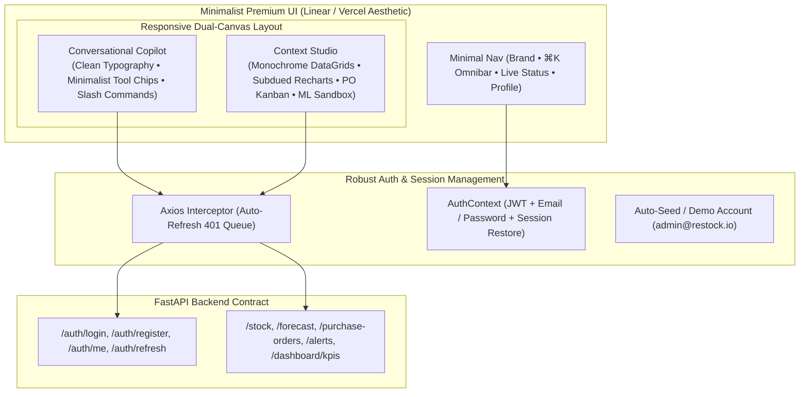

# Restock: Premium & Simplistic Frontend Upgrade Plan

## 1. Goal Description

Transform the Restock frontend from its current interface into an **ultra-clean, premium, and simplistic AI-first inventory operating system** (inspired by Linear, Vercel, and Apple Human Interface Guidelines). 

This plan addresses:
1. **Design Overhaul**: Replace heavy/colorful gradients with refined monochromatic minimalism (Obsidian/Zinc dark mode, crisp neutral light mode, subtle 1px micro-borders, razor-sharp typography, and calm status accents).
2. **Auth & Session System Fix**: Fix the mismatch between frontend login payloads (`email: EmailStr`) and backend schemas (`schemas.LoginRequest`), ensure seamless JWT access/refresh token rotation, auto-restore user sessions, and provide one-click demo access (`admin@restock.io` / `Password123!`).
3. **End-to-End Backend Wiring**: Ensure all tool calls and studio workspace components (`/dashboard/kpis`, `/stock`, `/forecast`, `/purchase-orders`, `/alerts`, `/eda`, `/upload`) connect accurately to FastAPI endpoints with zero contract mismatches.
4. **Multi-Agent Claude Execution Prompt**: A condensed, autonomous prompt for Claude Code using coordinated high-thinking and efficient agents.

---

## 2. Architecture & Aesthetic Overhaul



---

## 3. User Review Required

> [!IMPORTANT]
> **Authentication Schema Alignment**:
> The backend schema `schemas.LoginRequest` strictly requires `email: EmailStr` (not `username`) and `password: str` (min 8 chars on register). The login form, registration form, and auth context must strictly send `{ email, password }`.

> [!NOTE]
> **Minimalist Design Standard**:
> All neon glow effects and heavy multi-color gradients will be replaced with a sleek, high-contrast monochrome design system (Zinc-950, Zinc-900, Zinc-800, with refined emerald/amber/cobalt status pills and 150ms spring transitions).

---

## 4. Proposed Changes Grouped by Layer

### Layer A: Authentication & API Interceptor Fixes

#### [MODIFY] `frontend/src/context/AuthContext.js`
- Standardize authentication to `{ email, password }`.
- Ensure `getCurrentUser()` automatically executes on mount when `localStorage.getItem('accessToken')` exists.
- Clean up refresh token rotation failover and state reset on session expiration.

#### [MODIFY] `frontend/src/api/auth.js`
- Export clean functions: `login({ email, password })`, `register({ email, password, fullName })`, `getCurrentUser()`, `logoutRequest(refreshToken)`.

#### [MODIFY] `frontend/src/pages/ModernLoginPage.jsx` & `ModernRegisterPage.jsx`
- Replace username input with `email` input (`type="email"`).
- Implement pre-fill for demo account (`admin@restock.io` / `Password123!`).
- Add clean error alerts, loading state spinners, and instant redirect on successful authentication.

---

### Layer B: Premium Simplistic Design System

#### [MODIFY] `frontend/src/index.css` & `frontend/tailwind.config.js`
- Configure refined neutral palette (`zinc-950`, `zinc-900`, `zinc-800`, `zinc-100`, `neutral-50`).
- Use crisp 1px borders (`border-zinc-800/80` in dark, `border-zinc-200` in light).
- Restrained glassmorphic utility classes with subtle backdrop blurs (4px to 8px) and soft elevation shadows.

#### [MODIFY] `frontend/src/components/ModernNavbar.jsx`
- Minimalist header with monochrome branding, search trigger (`⌘K`), subtle alert counter pill, and clean user popover.

---

### Layer C: Conversational Copilot & Generative UI Widgets

#### [MODIFY] `frontend/src/components/chat/ChatContainer.jsx` & `ChatMessage.jsx`
- Clean conversation stream with typography-first message formatting.
- Minimalist action cards:
  - **Forecast Curve**: Single-line area chart with subdued P50 forecast and subtle shaded confidence interval.
  - **Reorder Action Card**: Compact table row with order quantity and quiet "Approve PO" action button.
  - **Stock Alert Radar**: Quiet badge with item name and threshold metric.
- Fast slash commands: `/alerts`, `/reorder`, `/forecast`, `/stock`, `/po`, `/kpi`, `/eda`.

---

### Layer D: Studio Workspaces & DataGrids

#### [MODIFY] `frontend/src/components/studio/`
- **`DashboardStudio.jsx`**: High-density executive KPI summary cards and clean actuals vs predicted area chart.
- **`InventoryStudio.jsx`**: Minimalist virtualized DataGrid with fast search, category filtering, and 1-click stock adjust modal.
- **`ForecastStudio.jsx`**: Clean slider controls for forecast horizon (7–90 days) and side-by-side model metric cards.
- **`PurchaseOrdersStudio.jsx`**: Streamlined Kanban board with status columns (*Draft* &rarr; *Submitted* &rarr; *Approved* &rarr; *Received*).
- **`AlertsStudio.jsx`**: Minimalist alert list with 1-click recompute and status resolution.
- **`EDAStudio.jsx`**: Quiet CSV dropzone and clean volume distribution bar chart.

---

## 5. Verification Plan

### Automated Tests
- Run unit and integration tests:
  ```bash
  cd frontend
  npm test -- --watchAll=false
  ```
- Run production bundle build check:
  ```bash
  npm run build
  ```
- Run backend pytest suite:
  ```bash
  cd ../backend
  ../.venv/bin/pytest
  ```

### Manual Verification
1. **Auth Flow**: Open `http://localhost:3000/login`, click "Fill Demo Credentials", sign in, verify user session is restored on page refresh.
2. **Chatbot Tools**: Type `/alerts`, `/reorder`, `/forecast`, and verify widgets render with live backend data.
3. **PO Lifecycle**: Advance a purchase order in the PO Kanban board and confirm optimistic update and backend sync.
4. **Stock Adjustment**: Adjust stock in the Inventory Grid and verify that on-hand/available quantities update immediately.

---

## 6. Condensed Master Prompt for Claude Code

The block below contains the complete, autonomous multi-agent prompt ready to copy and paste into Claude Code:

````markdown
You are an expert full-stack engineer and UI/UX architect tasked with executing a complete premium & simplistic overhaul of the Restock inventory application in `/home/taher-ali/restock`.

### Objective
1. Upgrade the frontend UI to look ultra-premium, simplistic, and minimal (Linear / Vercel aesthetic — neutral/zinc monochrome dark/light palette, crisp typography, 1px micro-borders, clean whitespace, and calm status accents).
2. Fix the login system & backend auth integration (FastAPI requires `email: EmailStr` and `password: str` in `schemas.LoginRequest`). Ensure JWT access & refresh tokens rotate properly, auto-refresh on 401s, and provide an instant 1-click demo login (`admin@restock.io` / `Password123!`).
3. Connect all frontend views and conversational AI tool widgets seamlessly to FastAPI endpoints (`/dashboard/kpis`, `/stock`, `/forecast`, `/purchase-orders`, `/alerts`, `/eda`, `/upload`).

### Multi-Agent Execution Strategy

Coordinate the work using 5 specialized agent roles:

- **Agent 1 (High Thinking - Lead Architect)**:
  Review contracts between `backend/schemas.py` and `frontend/src/api/*.js`. Ensure all API calls unwrap `{ items, total }` or direct responses correctly. Verify test suites.

- **Agent 2 (High Thinking - Auth & Session Specialist)**:
  - Fix `src/context/AuthContext.js` and `src/api/auth.js` to strictly send `{ email, password }` matching backend `LoginRequest`.
  - Update `src/pages/ModernLoginPage.jsx` and `ModernRegisterPage.jsx` with minimalist single-card design, email inputs, validation, and demo credentials filler (`admin@restock.io` / `Password123!`).
  - Ensure `api/client.js` transparently refreshes tokens on 401 and replays failed requests.

- **Agent 3 (High Thinking - Minimalist Design & Motion Specialist)**:
  - Refactor `tailwind.config.js` and `src/index.css` to use a refined Zinc/Neutral luxury palette, subtle glassmorphic classes (`glass-card`, `glass-panel`), crisp 1px borders, and physics-based spring transitions.
  - Simplify `src/components/ModernNavbar.jsx`, `CommandPalette.jsx` (`⌘K`), and layout headers.

- **Agent 4 (Efficient - Copilot & Studio Workspace Specialist)**:
  - Streamline `src/components/chat/` (clean message bubbles, typography-first text, fast slash commands `/alerts`, `/reorder`, `/forecast`, `/po`, `/stock`, `/kpi`, `/eda`).
  - Polish Generative UI widgets (`ForecastViewerWidget`, `ReorderActionWidget`, `AlertsRadarWidget`, `StockTableWidget`, `POStepperWidget`) to be clean and compact.
  - Polish Studio views (`DashboardStudio`, `ForecastStudio`, `InventoryStudio`, `PurchaseOrdersStudio`, `AlertsStudio`, `EDAStudio`) with minimalist charts and virtualized grids.

- **Agent 5 (Efficient - QA & Test Engineer)**:
  - Run `npm test -- --watchAll=false` in `frontend/` and ensure 100% tests pass.
  - Run `npm run build` in `frontend/` to verify clean production compilation.
  - Run `../.venv/bin/pytest` in `backend/` to ensure backend health.

Execute all changes, verify builds and tests, and provide a clear summary of completed work when done.
````
